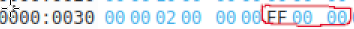
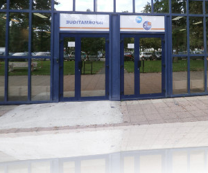

                SAE IMAGE

PARTIE A:

A0 :

    	Les deux premiers octets que nous pouvons lire dans ce fichier (42 4D en hexadécimal) correspond au type de fichier que nous somme en train d’analyser. Dans notre cas cela signifie que c’est un fichier BMP (image).
    Les quatre octets suivant correspond a la taille du fichier. Ici ce-dernier est représenter en little indian, il faut donc inverser les octets ( donc 99 73 0C 00 va devenir 00 0C 73 99 ) lorsqu’on le calcule, cela nous donne 816025 (qui est la taille de notre fichier). 
    Les quatre octets suivant correspond à des champs réserver. 
    Puis les quatre autre octets correspond à l’adresse de la zone de définition de l’image (00 00 00 1A en tenant compte de l’indiannes). Tout ceci est l’en-tête du fichier Bmp que nous sommes en-train d’analyser. Il est codé sur 14 octets.

    Maintenant nous allons analyser l’en-tête du bitmap. Sur 4 octets se trouve la taille en octets de cet en-tête, dans ce fichier cela correspond à (0C 00 00 00) mais nous devons l’inverser car ,nous somme en little indian donc cela devient (00 00 00 0C) qui vaut 11.
    Les 4 octets suivants sont la largeur de l’image en pixels, (80 02 A9 01) qui vaut 01 A9 02 80 = 27 853 440 pixels.
    Les 4octets suivants (01 00 18 00) sont la hauteur de l’image en pixels.  00 18 00 01 = 1 572 865   Donc notre image a une hauteur de 1 572 865 pixels.

    Les octets suivants sont les octets de l’image rapellons nous qu’à 1A nous obtenions  l’adresse de la zone de définition de l’image et nous y sommes arriver nous sommes en l’adresse 1A.

    Lorsque nous affichons l’image avec display nous obtenons une erreur. Cela est du à la taille du fichier. En effet dans le fichier la taille entrer est de  00 0C 73 99 qui vaut 816 025
    . alors que lorsque nous faisons ls -l  pour avoir la taille du fichier dans le terminale cela nous donne  816 026. Ce problème est du au fait que nous oublions de calculer l’octet à l’adresse 0. (de 0 à 5 il y a 5 valeur 1, 2, 3, 4 et 5 cela est compter par ce que l’on entre dans le fichier tandis que dans le terminal et pour la taille du fichier de 0 à 5 nous trouvons les valeurs 0, 1, 2, 3, 4 et 5). 

    Pour résoudre se problème nous devons ajouter 1 à 00 0C 73 99  cela nous donne donc : 00 0C 73 9A. Et entrer cette nouvelle valeur à la place de l’ancienne.

A1:

 

    L'en-tête du fichier est donné dans la consigne.
    Nous allon donc détailler directement le contenu.
    Le premier pixel de notre fichier commence à l'adresse 0x1A et il représente le pixel en bas à gauche, ce pixel est codé sur 3 octets. un octet pour la couleur bleu allant de 0 à 255, un octet pour vert allant de 0 à 255 et un octet pour le rouge allant de 0 à 255 (en tenant compte de l'endian). Sachant que ce pixel doit être de couleur rouge nous auront  00 00 FF (qui represente le rouge et qui est codé en hexadecimal) (FF=255) le second pixel est de couleur blanche donc nous auront FF FF FF. Nous allons continuer à code comme cela j'usqu'a arriver au dernier pixel du fichier qui se trouve en haut à droite.

    Notre Première image v a donc resembler à ça:

 

A2:

 

    L'en-tête du fichier est donné dans la consigne.
    Nous allon donc détailler directement le contenu.
    Le premier pixel de notre fichier commence à l'adresse 0x1A et il représente le pixel en bas à gauche, ce pixel est codé sur 3 octets. un octet pour la couleur bleu allant de 0 à 255, un octet pour vert allant de 0 à 255 et un octet pour le rouge allant de 0 à 255 (en tenant compte de l'endian). Sachant que ce pixel doit être de couleur cyan nous auront  FF FF 00(qui represente le cyan et qui est codé en hexadecimal le code rvb du cyan est donné dans le site: ) (FF=255) 
    le second pixel est de couleur magenta donc nous auront FF 00 FF (ce pixel est codé de la même manier que le premier nous remplaçons seulement le code rvb). Nous allons continuer à code comme  en donnant le code rvb du pixel que l'on veut cela jusqu'a arriver au dernier pixel du fichier qui se
    trouve en haut à droite.

    Dans ce fichier il y a les couleurs:(je vais donné les code rvb et l'adresse ou il aparaissent).
    cyan : FF FF 00 (adresse: 0x1A)
    magenta: FF 00 FF (adresse: 0x1D)
    bleu céruléen: E8 9D 0F (adresse: 0x20)
    bleu: FF 00 00 (adresse: 0x2F)
    vert: 00 FF 00 (adresse: 0x41)
    blanc: FF FF FF (adresse: 0x23)
    rouge: 00 00 FF (il se trouve dans tout les autres pixels du fuchiers).

    Notre Première image v a donc resembler à ça:

 

A3:
    
    0) Nous somme passe d'un fichier de 74 octets à 102. Le calcule est fait de cette maniére, nous faisons 74-12 (on enleve le poid du codage du BITMAPCOHEADER)
    donc 62+40 = 102 
    (40 est le poid du codage en BITMAPINFOHEADER)

    1) On utilise 24 bits par pixels. Soit 3 octets.
    
    2) Pour la taille des donnés pixels il faut faire le nombre de pixels * le nombre d'octet par pixel. Dans notre fichier nous avons 4 pixels par ligne et 4 colonnes donc 4*4=16 et nous utilisont 3 octets par pixels. Donc 16*3=48. Nous avons donc 48 octets de donnés pixels.

    3)Il n'y a pas de compressions utilisé car lorsque nous regardons l'adresse 0x1E nous pouvons voir que sur 4 bits nous avons que des 0.Ce qui nous indique bien que l'image n'a pas subit une compression.

    4)Les pixels sont codés sur 3 octets. Donc il n'y a pas de changements dans le codage des pixels.

A4:
    
    1) Il n'y a qu'un seul bits utilisé.

    2)1 seul bits est utilisés donc il vaut 1 octet.

    3) Il n'y a pas de compressions utilisé car lorsque nous regardons l'adresse 0x1E nous pouvons voir que sur 4 bits nous avons que des 0 donc l'image n'a pas subit une compression.

    4) Les couleurs de la palettes sont codés sur 4 bits. En effet le premier bits correspond à la couleur bleu. Le deuxiéme à la couleur vert et le troisiéme à la couleurs rouge (en tenant compte de l'endiannes). Le dérnier octet est un octet réserver.

    5) à l'adresse 0x2E est indiqueé sur 4 bits combien de couleur la palette contient ici elle vaut 2. Donc dans cette palette nous avons deux couleurs.

    6)Oui les pixels sont maintenant codés sur 1 bits 

    7)
 

    Ceci est le fichier que l'on a ouvert avec okteta. Dans ce fichier vous pouvez voir à l'adresse 0x36 les valeurs FF 00 00(sur 3 octets). 

    
    L'octet suivant vaut 00 est il est reserver.
    Cela corresepond à la couleur blue. En effet pour avoir la couleur rouge il y avait les valeurs 00 00 FF et nous les avons remplacer par les valeurs de la couleur bleu.
    Notre fichier ressemble donc à sa:  

     
    8) 

    
    Voici le fichier vu sous okteta. Nous utilisons les même couleur que pour la question précedente donc nous avons pas besoin de changer les couleurs de la palette. Or nous allons inverser l'odre des couleurs, pour ce faire tout les 4 octets les valeurs 50 00 00 00 deviendront A0 00 00 00 et les valeurs A0 00 00 00 deviendront 50 00 00 00. Voici la difference:
 Ceci correspond au 8 derniers octets de l'image precedente

 Ceci correspond au 8 derniers octets de l'image actuelle.

Vous pouvez donc bien voir que nous inversons l'ordre tout les 4 octets pour obtenir l'image.

    9)

 Voici notre image vu sous l'editeur okteta.
    ET maintenant voici notre image vu avec Imagemagick:

  

    10)
    Voici notre logo ouvert avec okteta aprés être passé en mode index de couleurs:

 

    11) On peut le trouver à l'adresse 0x2E sur 4 bits donc il vaut 00 00 00 10 (en little endian). Donc dans cette palette nous pouvons trouver 16 couleurs.(1*16=16)

    12) Il se trouvent à l'adresse 0x66 sur 4 bits. Il est codés sur 3 bits donc il vaut FE FE FD avec le bit reserve qui vaut 00.

    13) Le tableau de pixel commence à l'adresse 0x76.

    14)

A5) 
    
    2) Si nous passons la valeur de la hauteur de l'image à une valeur négatif ce-dernier inversera l'image voici notre imgage de départ:
     

    Voici la différence entre notre premiére image qui a une hauteur positf et la deuxieme une hauteur négatif. Pour ce faire nous codons la, valeur -4 en complement à 2 (le C2) et nous allons changer la valeur dans le fichier okteta. -4 vaut FC FF FF FF en C2. 

    La valeur entouré represente le -4. Au depart elle valait 04 00 00 00 (pour la valeur 4). 

    3) Lorsque nous avons fini de mettre la valeur de la hauteur en négatif nous obtenons:

Voici les changement sur le fichier okteta (nous avons passer la hauteur de l'image en négatif, en le codant en C2.)

A6)
    1) Le nouveaux fichier vaut 1120 octets. Il y a une palette de couleur qui contient 16³ couleurs. C'est pourquoi la taille de notre image a augmenter.

    2) Il est donnée à l'adresse 0x0A est il renvoie à l'adresse 0x436 ou les couleur de l'image débute.

    3) Les pixels sont codés sur deux bits le premier bit correspond au nombre de pixel que l'on va colorier et le second bit correspond à la couleur dans la palette. 
    
 
    

Le premier bit (il se trouve à l'adresse 0x436) vaut 01 cela veut dire que l'on va colorier 1 pixel, le second bit vaut 00 cela correspond à la couleur rouge dans notre palette. Donc nous avons notre premier pixel de couleur rouge. 
    
 
    
Les deux bits suivants vaut 01 01 cela veut dire que l'on va avoir un pixel de couleur blanc (01 coresspond a la couleur blanche).  

Une fois que nous avons codés notre premiére ligne nous devont faire un saut, pour ce faire nous entrons sur deux bit 00 00.Dec cette maniére: 

Et pour finir le fichier nous entrerons les valeurs 00 01 pour signaler que c'est la fin du bitmap (du fichier).
    

A7)
    
    1) L'image vaut 1102 octets. Dans l'image 5 la première ligne est codé de la même façon que l'image 4, or les 3 autres lignes sont codé differament. En effet sur ces 3 lignes nous avons que des pixels rouge donc nous indiquons sur le premier bit le nombre de pixels qu'il y a sur la ligne et sur le deuxieme bit sa couleur. Donc nous gagnons énormement de place car nous codons pas tout les pixels une par une (comme c'est le cas dans l'image 4). C'est pour cela que l'image 5 est moin grand que l'image 4.

    2)
    Les pixels sont codés sur deux bits le premier bit correspond au nombre de pixel que l'on va colorier et le second bit correspond à la couleur dans la palette. 
 
    Le premier bit (à l'adresse 0x436) vaut 01 cela veut dire que l'on va colorier 1 pixel, le second bit vaut 01 cela correspond à la couleur blanche.
    Donc nous avons notre premier pixel de couleur blanche. 
    

    Les deux bits suivants vaut 01 00 cela veut dire que l'on va avoir un pixel de couleur rouge (00 coresspond a la couleur rouge). 

    Une fois que nous avons codés notre premiére ligne nous devont faire un saut, pour ce faire nous entrons sur deux bit 00 00. 
    

    Ensuite pour les 3 autre lignes ont indique que l'on va colorier 4 pixels de couleur rouge et faire un saut de ligne. Donc nous entrons 04 00 00 00 (04 00 veut dire 4 pixels de couleur rouge et 00 00 veut dire le saut de ligne).

A8)

Les 6 premiers bit de l'image correspond à la palette de couleur (00 00 00 00 00 00 ).
Ensuite nous pouvons voir que nous commençons par mettre deux pixels blanc avec(02 01) un pixel rouge (01 00) et un autre pixel blanc (00 01) puis nous faison un saut de ligne (00 00) puis nous mettons la ligne en rouge (04 00) en saute une ligne (00 00) puis nous remettons la ligne en rouge (04 00) en saute une ligne (00 00) et sur la dernière ligne on met un pixel blanc (01 01) puis un pixel rouge(01 00) un pixel blanc (01 01) et un dernier pixel rouge (01 00) et ,ous fermons le fichier avec (00 00 00 01).

Et nous obtenons: 

A9)

Pour commencer nous allons rejouter des couleurs dans notre palette.

couleur dans la palette:
    rouge (00 00 FF) 
    blanc (FF FF FF)
    bleu  (FF 00 00)
    vert  (00 FF 00)

Le fichier est code de la même maniere que le fichier 8 sauf que lorsque nous avons une ligne verte nous mettons les valeur 04 03 comme ceci:

et le pixel bleu nous mettons 01 02 comme ceci:

Nous obtenons cette image:

A10)

    Pour cette image la palette de couleur est la même que pour la question précédente.
    Or le changement est fait dans le code:

    Pour mettre la valeur rouge on entre 00 qui prendra sa référence dans la palette. Pour le blanc c'est : 01, le bleu c'est: 02 et le vert c'est: 03.

    Les 6 premiers bit de l'image correspond à la palette de couleur (00 00 00 00 00 00 ).
    Ensuite nous pouvons voir que nous commençons par mettre deux pixels blanc avec(02 00) un pixel bleu (01 02) et un autre pixel blanc (00 00) puis nous faison un saut de ligne (00 00) (Fin premiére ligne).

    Nous mettons un pixel en rouge (01 00), un pixel en vert (01 03) et deux pixel rouge (02 00) en saute une ligne (00 00) (Fin deuxième ligne)
    
    Nous metton deux pixel en vert (02 03), un pixel rouge (01 00), un pixel vert (01 03), en saute une ligne (00 00) (fin troisième ligne)
    
    Et sur la dernière ligne on met un pixel blanc (01 01) puis un pixel rouge(01 00) un pixel blanc (01 01) et un dernier pixel rouge (01 00) et ,ous fermons le fichier avec (00 00 00 01).

Et nous allons obtenir cette image:

    Dans la seconde partie de l'exercice il nous est demandé de supprimé les couleurs inutiles dans la palette de couleur est de l'enregistrer dans un fichier nommé Image 9.bmp
    Notre image 8 fait 1114 octet lorsque nous supprimons les couleurs inutiles dans la palette Il ne reste plus que 106 octets.

    voici à quoi resemble le fichier okteta de l'image 9 avec une palette trés réduite:

PARTIE B:

B1) 

    Je commence par ouvrir mon fichier dans une variable nommé mon_image (ligne 3-5)
    Je crée un fonction pour tourner mon image:
    Je commence par copier mon image dans une variable nommé sortie (ligne 8)

    Puis je parcour les pixels de mon image i (avec mes deux boucle for). (ligne 19-21)
    Je recupére le code rvb du pixel de mon image i et le stock dans la variable c (c pour couleur) avec c=i.getpixel((x,y))
    (ligne 22)

    Puis je fait la transposé de mon image, c'est a dire que j'inverse les ligne et les colonnes pour obtenir l'image demandé. J'utilise cela pour ce faire sortie.putpixel((y,x),c) (je change le pixel de la position colonne ligne à la position ligne colonne). Je change donc les pixels de mon image de sortie. (ligne 25)

    Puis j'enregistre ce fichier à la postion de sortie que l'utilisateur va indiquer (personnelement je l'enregistre dans le repertoire courant codeb2_et_image sous le nom de Imageou0.bmp)

Voici l'image test de départ:

Voici la même image aprés le passage du code:

## EXERCICE B2)

    Dans ce code je commence par ouvrir mon image à la ligne 3.

    Pour faire ce qui est demandé je vais crée une fonction qui prend en parametre une image bmp et un chemin pour enregistrer la nouvelle image.
    Je commence par copier mon image bmp (ligne 15) et j'enregistre le longueur de mon image dans une variable nommé width (ligne 16).
    Ensuite je parcours mon image par c'est pixels. je récuper le code RVB dans la variable c (ligne 21) et je vais changée les pixels de la fin de ma ligne et sur la meme colonne par le pixels de la ligne du début.
    
    Exemple: si mon image fait 10 pixel de longueur je prend le premier pixel et dans mon image copier je change le 10éme  pixel par le premier que j'ai récuperer.
    (le pixel 1 devient le pixel 10 dans mon image copie).

Voici l'image de départ:  

Voici l'image obtenu aprés le code: 

## EXERCICE B3)

    J'ouvre mon image à la ligne 3.

    Je vais crée une fonction niveau de gris pour faire ce qui est demandé.
    A cette fonction nous allons lui attribué deux parmaétre celui de l'image dans une varable nommé i et un chemin pour le repertoire de sortie.

    Dans cette fonction je commence par copié mon image dans une variable nommé sortie. (à la ligne 13)
    Puis je parcours mon image i et je récupere le code rvb de chacun des pixels dans une variable c.( ligne 17-18)

    Pour mettre un pixel en niveau de gris nous allons utilisé la formule donné qui est : (rouge + vert + bleu)/3
    Dans la ligne 19 j'utilise cette formule est je le met dans une variable nv_col.

    Puis dans le copie je change le code RVB des pixels par le code RVB que j'ai obtenu avec le niveau de gris.

Voici mon image de départ: 

Voici l'image aprés le code:

Nous pouvons bien voir que nos pixels sont grisé.

## EXERCICE B4)

    J'ouvre l'image demandé.
    
    Pour mettre mon image en noir et blanc je commence par crée une fonction qui prend deux parametre: l'image et le repertoire de sortie.

    Par la suite je copie mon image (ligne 13)

    Je parcour mon image et je prend le code RVB dans une variable c.

    La formule pour mettre le pixel en noir ou en blanc c'est:
    (Rouge² + Vert² + Bleu²), c'est notre ligne 19 et on le met dans une variable nommé nv_col.
    Ensuite on verifie si nv_col est supérieur à 255*255*3/2
    alors le pixel sera blanc et on va le changer (ligne 21).
    Sinon le pixel sera noir et on va le changer (ligne 23).

    Ps: si le pixel est blanc son code RVB est: 255, 255, 255
    si le pixel est noir son code RVB est: 00, 00, 00.

Voici mon image de départ: 

Voici l'image aprés le code:

## EXERCICE B5)