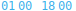
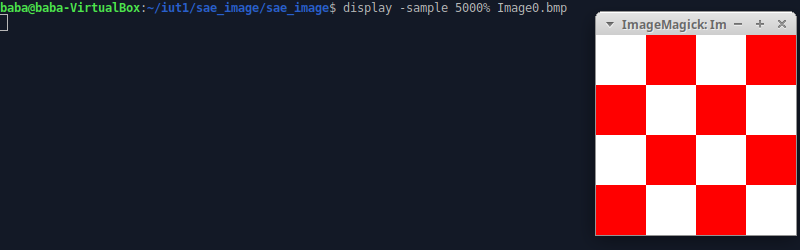
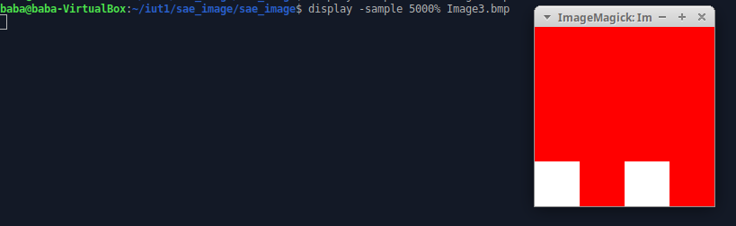
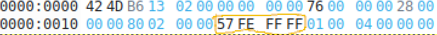
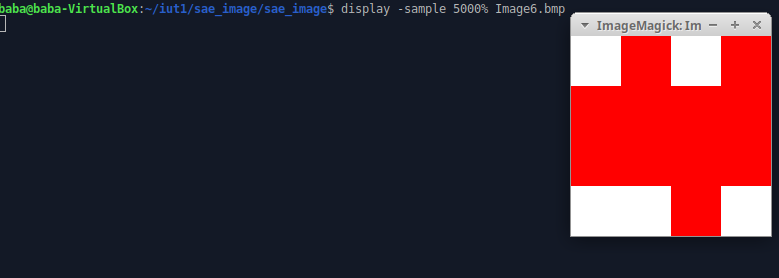
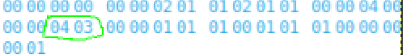
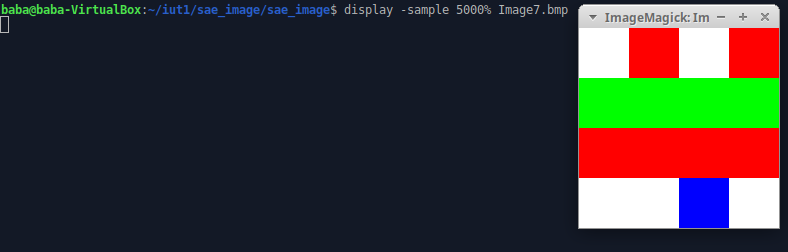

                SAE IMAGE

# Petite explication avant de passer au codage:
    Dans cette SAE nous allons avoir besoin d'un editeur hexadecimale: okteta et d'un utilitaire (de la suite logicielle ImageMagick) très commode que nous utiliserons par la suite dans ce devoir: display

    Voici comment lire une adresse dans un fichier okteta:

    Les chiffres marqué à gauche sont les adresses. Donc 0000: 0000 est l'adresse 0x00 à cette adresse nous retrouverons l'octet qui a pour valeur 42. l'octet suivant est: 4D sont adresse est: 0x01
    
    De la même maniere les valeurs 0000: 0010 correspond à l'adresse 0x10 à cette adresse nous trouverons l'octet 00.
    Les deux octets suivant sont 00 80 cela correspond à l'adresse 0x11 et l'adresse 0x12.

# PARTIE A:

## EXERCICE A0 :

### Partie 1: 

    Ces deux premiers octets que nous pouvons lire dans ce fichier sont 42 4D codé en hexadécimal, cela correspond au type de fichier que nous sommes en train d’analyser (42 et 4D represente dans la table ASCII les lettres BM). Dans notre cas cela signifie donc que c’est un fichier BMP (image). 

    Ces quatre octets suivants correspond à la taille du fichier. Ici la taille est représenter en little indian, il faut donc inverser les octets (donc 99 73 0C 00 va devenir 00 0C 73 99 ) lorsqu’on le calcule, cela nous donne 816 025 octets ce qui est la taille de notre fichier.

    
    Les quatre octets suivant sont des champs réserver. (il valent 00 00 00 00).

 
    
    Puis les quatre octets suivant correspond à l’adresse de la zone de définition de l’image, donc à cette adresse commence le codage des pixels. Il vaut: 00 00 00 1A en tenant compte de l’indiannes (dans okteta cela est noter 1A 00 00 00).
    
   
    
    Tout ceci est l’en-tête du fichier Bmp que nous sommes en-train d’analyser. Il est codé sur 14 octets.

#
 

    Maintenant nous allons analyser l’en-tête du bitmap. Sur 4 octets se trouve la taille en octets de cet en-tête, dans ce fichier cela correspond à (0C 00 00 00) mais nous devons l’inverser car ,nous somme en little indian donc cela devient (00 00 00 0C) qui vaut 11.

 

    Les 4 octets suivants sont la largeur de l’image en pixels, (80 02 A9 01) qui vaut 01 A9 02 80 = 27 853 440 pixels.
    (Pour le calculer nous faisons: 0+ 8*16 + 2*16² + 0 + 9*16⁴ + 10*16⁵ + 1*16⁶ + 0)

    Les 4 octets suivants (01 00 18 00) sont la hauteur de l’image en pixels.  00 18 00 01 = 1 572 865   Donc notre image a une hauteur de 1 572 865 pixels.
    (Pour le calculer nous faisons: 1*16⁰ + 8*16⁴ + 1*16⁵)

    Les octets suivants sont les octets de l’image rapellons nous qu’à 0x1A nous obtenons  l’adresse de la zone de définition de l’image et nous y sommes arriver nous sommes à l’adresse 1A.

### Partie2:

    Lorsque nous affichons l’image avec la commande display, nous obtenons une erreur. Cela est du à la taille du fichier. En effet dans le fichier la taille entrer est de  00 0C 73 99 qui vaut 816 025 octets.

    Alors que lorsque nous faisons ls -l  pour avoir la taille du fichier dans le terminale cela nous donne  816 026.
    
    
    
    Ce problème est du au fait que nous oublions de calculer l’octet à l’adresse 0. 
    Expemple: de 0 à 5 il y a 5 valeur 1, 2, 3, 4 et 5 cela est compter par ce que l’on entre dans le fichier tandis que dans le terminal et pour la taille du fichier il faut compter de 0 à 5 nous trouvons donc les valeurs 0, 1, 2, 3, 4 et 5). 

    Pour résoudre se problème nous devons donc ajouter 1 à 816 025 et le traduire en hexadecimal. Cela nous donne donc : 00 0C 73 9A. Sachant que nous devons entrer cette valeur en little endian nous allons inverser les octets, cela va nous donne 9A 73 0C 00. Maintenant nous pouvons entrer cette nouvelle valeur à la place de l’ancienne et le probléme sera résolu.

Dans l'en-tête du fichier nous allons donc obtenir: 

 Et voici donc la nouvelle en-tet que nous avons: 

## EXERCICE A1:

 

    L'en-tête du fichier est donné dans la consigne. Nous allon donc détailler directement le contenu.

    

    Le premier pixel de notre fichier commence à l'adresse 0x1A et il représente le pixel en bas à gauche, ce pixel est codé sur 3 octets. un octet pour la couleur bleu allant de 0 à 255, un octet pour vert allant de 0 à 255 et un octet pour le rouge allant de 0 à 255 (en tenant compte de l'endian car si on ne tient pas compte de l'endianesse on obtient Rouge, Vert, Bleu). Sachant que ce pixel doit être de couleur rouge nous auront  00 00 FF (qui represente le rouge et qui est codé en hexadecimal) (FF=255)

    
 

    le second pixel est de couleur blanche donc nous auront FF FF FF. Nous allons continuer à codé comme cela j'usqu'à ce que nous arrivons au dernier pixel du fichier qui se trouve en haut à droite.

Notre Première image va donc resembler à ça:

 

## EXERCICE A2:

 

    L'en-tête du fichier est donné dans la consigne. Nous allon  donc détailler directement le contenu.

    Le premier pixel de notre fichier commence à l'adresse 0x1A et il représente le pixel en bas à gauche, ce pixel est codé sur 3 octets. un octet pour la couleur bleu allant de 0 à 255, un octet pour vert allant de 0 à 255 et un octet pour le rouge allant de 0 à 255 (en tenant compte de l'endian si nous l'on n'en tient pas compte l'ordre n'est pas inverser et donc nous obtenons du Rouge puis du Vert puis du bleu).
    

Sachant que ce pixel doit être de couleur cyan nous auront  FF FF 00(qui represente le cyan et qui est codé en hexadecimal le code rvb du cyan est donné dans le site ) (FF=255). 
Dans le fichier okteta il ressemble à sa:
 

    Le second pixel est de couleur magenta donc nous auront FF 00 FF (ce pixel est codé de la même maniere que le premier nous remplaçons seulement le code rvb).
Dans le fichier okteta il ressemble à sa:
 
    
    
    Nous allons continuer à code comme  en donnant le code rvb du pixel que l'on veut cela jusqu'a arriver au dernier pixel du fichier qui se
    trouve en haut à droite.

    Dans ce fichier il y a les couleurs:(je vais donné les code rvb et l'adresse ou il aparaissent).
    cyan : FF FF 00 (adresse: 0x1A)
    magenta: FF 00 FF (adresse: 0x1D)
    bleu céruléen: E8 9D 0F (adresse: 0x20)
    bleu: FF 00 00 (adresse: 0x2F)
    vert: 00 FF 00 (adresse: 0x41)
    blanc: FF FF FF (adresse: 0x23)
    rouge: 00 00 FF (Tout les autres pixels du fuchiers).

    Notre Image va donc resembler à ça:

 

## EXERCICE A3:
    
Commande à utiliser pour la suite de notre exercice et qui va nous donner une nouvelle façon de coder:
convert Image0.bmp bmp3:Image1.bmp

    0) Nous somme passe d'un fichier de 74 octets à 102. Le calcule est fait de cette maniére, nous faisons 74-12 (on enleve le poid du codage du BITMAPCOHEADER)
    donc 62+40 = 102 
    (40 est le poid du codage en BITMAPINFOHEADER)

    1) On utilise 24 bits par pixels. Soit 3 octets.
    
    2) Pour la taille des donnés pixels il faut faire le nombre de pixels * le nombre d'octet par pixel. Dans notre fichier nous avons 4 pixels par ligne et 4 colonnes donc 4*4=16 et nous utilisont 3 octets par pixels. Donc 16*3=48. Nous avons donc 48 octets de donnés pixels.

    3)Il n'y a pas de compressions utilisé car lorsque nous regardons l'adresse 0x1E nous pouvons voir que sur 4 bits nous avons que des 0.Ce qui nous indique bien que l'image n'a pas subit une compression.

    4)Les pixels sont codés sur 3 octets. Donc il n'y a pas de changements dans le codage des pixels.

## EXERCICE A4:
    
    1) Il y'a 8 bits utilisé par pixel soit un octet.

    2)la taille des donnés pixels est de 16 octet. 

    3) Il n'y a pas de compressions utilisé car lorsque nous regardons l'adresse 0x1E nous pouvons voir que sur 4 octets nous avons que des 0 donc l'image n'a pas subit une compression.

    4) Les couleurs de la palettes sont codés sur 4 octets. En effet le premier octet correspond à la couleur bleu. Le deuxiéme à la couleur vert et le troisiéme à la couleurs rouge (en tenant compte de l'endiannes). Le dérnier octet est un octet réserver.

    5) à l'adresse 0x2E est indiqueé sur 4 octets combien de couleur la palette contient ici elle vaut 2. Donc dans cette palette nous avons deux couleurs.

    6)Oui le codage des pixels sont maintenant codés sur 1 octet. 

    7)
 

    Ceci est le fichier que l'on a ouvert avec okteta. Dans ce fichier vous pouvez voir à l'adresse 0x36 les valeurs FF 00 00(sur 3 octets). 

    
    L'octet suivant vaut 00 est il est reserver.
    Cela corresepond à la couleur blue. En effet pour avoir la couleur rouge il y avait les valeurs 00 00 FF et nous les avons remplacer par les valeurs de la couleur bleu.
    Notre fichier ressemble donc à sa:  

     
    8) 

    
    Voici le fichier vu sous okteta. Nous utilisons les même couleur que pour la question précedente donc nous avons pas besoin de changer les couleurs de la palette. Or nous allons inverser l'odre des couleurs, pour ce faire tout les 4 octets les valeurs 50 00 00 00 deviendront A0 00 00 00 et les valeurs A0 00 00 00 deviendront 50 00 00 00. Voici la difference:
 Ceci correspond au 8 derniers octets de l'image precedente

 Ceci correspond au 8 derniers octets de l'image actuelle.

Vous pouvez donc bien voir que nous inversons l'ordre tout les 4 octets pour obtenir l'image.

    9)

 Voici notre image vu sous l'editeur okteta.
    ET maintenant voici notre image vu avec Imagemagick:

  

    10)
    Voici notre logo ouvert avec okteta aprés être passé en mode index de couleurs:

 

    11) On peut le trouver à l'adresse 0x2E sur 4 bits donc il vaut 00 00 00 10 (en little endian). Donc dans cette palette nous pouvons trouver 16 couleurs.(1*16=16)

    12) Il se trouvent à l'adresse 0x66 sur 4 bits. Il est codés sur 3 bits donc il vaut FE FE FD avec le bit reserve qui vaut 00.

    13) Le tableau de pixel commence à l'adresse 0x76.

    14)

## EXERCICE A5) 
    
    2) Si nous passons la valeur de la hauteur de l'image à une valeur négatif ce-dernier inversera l'image voici notre imgage de départ:
     

    Voici la différence entre notre premiére image qui a une hauteur positf et la deuxieme une hauteur négatif. Pour ce faire nous codons la, valeur -4 en complement à 2 (le C2) et nous allons changer la valeur dans le fichier okteta. -4 vaut FC FF FF FF en C2. 

    La valeur entouré represente le -4. Au depart elle valait 04 00 00 00 (pour la valeur 4). 

    3) Lorsque nous avons fini de mettre la valeur de la hauteur en négatif nous obtenons:

Voici les changement sur le fichier okteta (nous avons passer la hauteur de l'image en négatif, en le codant en C2.)

## EXERCICE A6)
    1) Le nouveaux fichier vaut 1120 octets. Il y a une palette de couleur qui contient 16³ couleurs. C'est pourquoi la taille de notre image a augmenter.

    2) Il est donnée à l'adresse 0x0A est il renvoie à l'adresse 0x436 ou les couleur de l'image débute.

    3) Les pixels sont codés sur deux bits le premier bit correspond au nombre de pixel que l'on va colorier et le second bit correspond à la couleur dans la palette. 
    
 
    

Le premier bit (il se trouve à l'adresse 0x436) vaut 01 cela veut dire que l'on va colorier 1 pixel, le second bit vaut 00 cela correspond à la couleur rouge dans notre palette. Donc nous avons notre premier pixel de couleur rouge. 
    
 
    
Les deux bits suivants vaut 01 01 cela veut dire que l'on va avoir un pixel de couleur blanc (01 coresspond a la couleur blanche).  

Une fois que nous avons codés notre premiére ligne nous devont faire un saut, pour ce faire nous entrons sur deux bit 00 00.Dec cette maniére: 

Et pour finir le fichier nous entrerons les valeurs 00 01 pour signaler que c'est la fin du bitmap (du fichier).
    

A7)
    
    1) L'image vaut 1102 octets. Dans l'image 5 la première ligne est codé de la même façon que l'image 4, or les 3 autres lignes sont codé differament. En effet sur ces 3 lignes nous avons que des pixels rouge donc nous indiquons sur le premier bit le nombre de pixels qu'il y a sur la ligne et sur le deuxieme bit sa couleur. Donc nous gagnons énormement de place car nous codons pas tout les pixels une par une (comme c'est le cas dans l'image 4). C'est pour cela que l'image 5 est moin grand que l'image 4.

    2)
    Les pixels sont codés sur deux bits le premier bit correspond au nombre de pixel que l'on va colorier et le second bit correspond à la couleur dans la palette. 
 
    Le premier bit (à l'adresse 0x436) vaut 01 cela veut dire que l'on va colorier 1 pixel, le second bit vaut 01 cela correspond à la couleur blanche.
    Donc nous avons notre premier pixel de couleur blanche. 
    

    Les deux bits suivants vaut 01 00 cela veut dire que l'on va avoir un pixel de couleur rouge (00 coresspond a la couleur rouge). 

    Une fois que nous avons codés notre premiére ligne nous devont faire un saut, pour ce faire nous entrons sur deux bit 00 00. 
    

    Ensuite pour les 3 autre lignes ont indique que l'on va colorier 4 pixels de couleur rouge et faire un saut de ligne. Donc nous entrons 04 00 00 00 (04 00 veut dire 4 pixels de couleur rouge et 00 00 veut dire le saut de ligne).

## EXERCICE A8)

Les 6 premiers bit de l'image correspond à la palette de couleur (00 00 00 00 00 00 ).
Ensuite nous pouvons voir que nous commençons par mettre deux pixels blanc avec(02 01) un pixel rouge (01 00) et un autre pixel blanc (00 01) puis nous faison un saut de ligne (00 00) puis nous mettons la ligne en rouge (04 00) en saute une ligne (00 00) puis nous remettons la ligne en rouge (04 00) en saute une ligne (00 00) et sur la dernière ligne on met un pixel blanc (01 01) puis un pixel rouge(01 00) un pixel blanc (01 01) et un dernier pixel rouge (01 00) et ,ous fermons le fichier avec (00 00 00 01).

Et nous obtenons: 

## EXERCICE A9)

Pour commencer nous allons rejouter des couleurs dans notre palette.

couleur dans la palette:
    rouge (00 00 FF) 
    blanc (FF FF FF)
    bleu  (FF 00 00)
    vert  (00 FF 00)

Le fichier est code de la même maniere que le fichier 8 sauf que lorsque nous avons une ligne verte nous mettons les valeur 04 03 comme ceci:

et le pixel bleu nous mettons 01 02 comme ceci:

Nous obtenons cette image:

## EXERCICE A10)

    Pour cette image la palette de couleur est la même que pour la question précédente.
    Or le changement est fait dans le code:

    Pour mettre la valeur rouge on entre 00 qui prendra sa référence dans la palette. Pour le blanc c'est : 01, le bleu c'est: 02 et le vert c'est: 03.

    Les 6 premiers bit de l'image correspond à la palette de couleur (00 00 00 00 00 00 ).
    Ensuite nous pouvons voir que nous commençons par mettre deux pixels blanc avec(02 00) un pixel bleu (01 02) et un autre pixel blanc (00 00) puis nous faison un saut de ligne (00 00) (Fin premiére ligne).

    Nous mettons un pixel en rouge (01 00), un pixel en vert (01 03) et deux pixel rouge (02 00) en saute une ligne (00 00) (Fin deuxième ligne)
    
    Nous metton deux pixel en vert (02 03), un pixel rouge (01 00), un pixel vert (01 03), en saute une ligne (00 00) (fin troisième ligne)
    
    Et sur la dernière ligne on met un pixel blanc (01 01) puis un pixel rouge(01 00) un pixel blanc (01 01) et un dernier pixel rouge (01 00) et ,ous fermons le fichier avec (00 00 00 01).

Et nous allons obtenir cette image:

    Dans la seconde partie de l'exercice il nous est demandé de supprimé les couleurs inutiles dans la palette de couleur est de l'enregistrer dans un fichier nommé Image 9.bmp
    Notre image 8 fait 1114 octet lorsque nous supprimons les couleurs inutiles dans la palette Il ne reste plus que 106 octets.

    voici à quoi resemble le fichier okteta de l'image 9 avec une palette trés réduite:

# PARTIE B:

## EXERCICE B1) 

    Je commence par ouvrir mon fichier dans une variable nommé mon_image (ligne 3-5)
    Je crée un fonction pour tourner mon image:
    Je commence par copier mon image dans une variable nommé sortie (ligne 8)

    Puis je parcour les pixels de mon image i (avec mes deux boucle for). (ligne 19-21)
    Je recupére le code rvb du pixel de mon image i et le stock dans la variable c (c pour couleur) avec c=i.getpixel((x,y))
    (ligne 22)

    Puis je fait la transposé de mon image, c'est a dire que j'inverse les ligne et les colonnes pour obtenir l'image demandé. J'utilise cela pour ce faire sortie.putpixel((y,x),c) (je change le pixel de la position colonne ligne à la position ligne colonne). Je change donc les pixels de mon image de sortie. (ligne 25)

    Puis j'enregistre ce fichier à la postion de sortie que l'utilisateur va indiquer (personnelement je l'enregistre dans le repertoire courant codeb2_et_image sous le nom de Imageou0.bmp)

Voici l'image test de départ:

Voici la même image aprés le passage du code:

## EXERCICE B2)

    Dans ce code je commence par ouvrir mon image à la ligne 3.

    Pour faire ce qui est demandé je vais crée une fonction qui prend en parametre une image bmp et un chemin pour enregistrer la nouvelle image.
    Je commence par copier mon image bmp (ligne 15) et j'enregistre le longueur de mon image dans une variable nommé width (ligne 16).
    Ensuite je parcours mon image par c'est pixels. je récuper le code RVB dans la variable c (ligne 21) et je vais changée les pixels de la fin de ma ligne et sur la meme colonne par le pixels de la ligne du début.
    
    Exemple: si mon image fait 10 pixel de longueur je prend le premier pixel et dans mon image copier je change le 10éme  pixel par le premier que j'ai récuperer.
    (le pixel 1 devient le pixel 10 dans mon image copie).

Voici l'image de départ:  

Voici l'image obtenu aprés le code: 

## EXERCICE B3)

    J'ouvre mon image à la ligne 3.

    Je vais crée une fonction niveau de gris pour faire ce qui est demandé.
    A cette fonction nous allons lui attribué deux parmaétre celui de l'image dans une varable nommé i et un chemin pour le repertoire de sortie.

    Dans cette fonction je commence par copié mon image dans une variable nommé sortie. (à la ligne 13)
    Puis je parcours mon image i et je récupere le code rvb de chacun des pixels dans une variable c.( ligne 17-18)

    Pour mettre un pixel en niveau de gris nous allons utilisé la formule donné qui est : (rouge + vert + bleu)/3
    Dans la ligne 19 j'utilise cette formule est je le met dans une variable nv_col.

    Puis dans le copie je change le code RVB des pixels par le code RVB que j'ai obtenu avec le niveau de gris.

Voici mon image de départ: 

Voici l'image aprés le code:

Nous pouvons bien voir que nos pixels sont grisé.

## EXERCICE B4)

    J'ouvre l'image demandé.
    
    Pour mettre mon image en noir et blanc je commence par crée une fonction qui prend deux parametre: l'image et le repertoire de sortie.

    Par la suite je copie mon image (ligne 13)

    Je parcour mon image et je prend le code RVB dans une variable c.

    La formule pour mettre le pixel en noir ou en blanc c'est:
    (Rouge² + Vert² + Bleu²), c'est notre ligne 19 et on le met dans une variable nommé nv_col.
    Ensuite on verifie si nv_col est supérieur à 255*255*3/2
    alors le pixel sera blanc et on va le changer (ligne 21).
    Sinon le pixel sera noir et on va le changer (ligne 23).

    Ps: si le pixel est blanc son code RVB est: 255, 255, 255
    si le pixel est noir son code RVB est: 00, 00, 00.

Voici mon image de départ: 

Voici l'image aprés le code:

## EXERCICE B5)

    Pour cette exercice nous allons diviser les question en 3 partie, 3 fonctions. Dans la première partie nous allons libere de la place dans nos pixels pour pouvoir mettre une deuxiéme image. Dans la seconde partie nous allons cacher une image dans une image et dans la troisème partie nous allons retrouver l'image que nous avons cacher.

### Partie 1:
    

    Je commence par créé deux fonction qui vont nous permettre de cacher et de retrouver l'image caché ( je vais utiliser c'est ces deux fonction dans les deux procaine partie).

    Pour liberer de la place je commence par parcourir mon image et de mettre le code RVB des pixels dans une variable c. (ligne 17-20)
    Ensuite dans valeur_r je soustrait à la valeur rouge le reste de la division par deux de cette valeur. 
    (Rouge = Rouge - Rouge%2) Je le fait à la ligne 21.
    
    Et Je l'enregistre dans un fichier nommé Imageout_steg_0.bmp

Voici l'image avant le code:

Voici l'image aprés le code libere:

A l'oeil nu l'Humain ne voit aucune différence entre ces deux images.

### Partie 2:

    Dans cette partie je vait utiliser le code cacher pour cacher une image dans un autre.

#
#
fonction cacher:

    Dans cette fonction je vais parcourir mon image à cacher que j'ai nommé image_a_cacher. (Je parcoure cette image car elle est plus petite que l'image pricipale, de plus si l'image à cacher était plus grande cela ne fonctionnerait pas.) 
    
    Je récupere les pixels de mon image pricipale et de mon image à cacher. (ligne 41-42)
    Ensuite j'utilise la même formule que l'Exercice 4 pour vérifier si le pixel de l'image à cacher sera noir ou blanc.
    
    Si il est blanc je le cache avec une valeur de b=1 dans ma fonction caher. (LA couleur rouge du pixel sera un nombre impair cela va nous aider à retrouver notre image dans la partie 3)
    Si il est noir je le cache avec une valeur de b=0 dans ma fonction caher.(LA couleur rouge du pixel sera un nombre pair cela va nous aider à retrouver notre image dans la partie 3).
    
    Et je finit par le changer dans moi image de sortie. (ligne 45 et 47)

Voici l'image de départ:

Voici l'image de fin:

Vous ne voyez toujours pas de différence à l'oeil nu attendez la paartie 3 pour voir ce qu'il y a dans cette image.

### Partie 3:

Dans cette partie je vait utiliser la fonction trouver: 

Et je vait utiliser ma fonction retrouver une image cacher:

    Dans cette fonction je parcoure mon image et je récupère le code RVB des pixels de l'image. (ligne 64-67) 

    Par la suite je regarde si la couleur rouge du pixel est pair ou impair. Si il est pare c'est que le pixel est de couleur noir. Alors je vait changer le pixel de l'image de sortie en couleur noir.
    Si il est impaire c'est que le pixel est de couleur blanche.Alors je vait changer le pixel de l'image de sortie en couleur blanc.

    Et grace à ce code je vait obtenir mon image que j'avais cacher au départ.

Voici l'image que nous avons au début:

Et voici l'image qui était cacher à l'interieur:

Maintenant à l'oeil nu nous pouvons voir ce qui était cacher.

# Partie B Bonus:

## EXERCICE B6)

    Dans cette exercice il nous est demandé de caché du texte dans une image.
    Au début npous commençons par faire les même fonction que l'exercice B5.
    Nous allons copier les fonctions cacher, trouver et libere_place.
    La fonction liber place permet de degrader le pixel rouge d'un chiffre si il est impaire.

    J'ai enregistrer le fichier avec la couleur rouge degrader sous le nom de: Image_steg_out0_partie_b6.bmp
    J'ai crée une fonction pour cacher mon image.
    J'ai diviser cette fonction en deux partie:

    Dans cette partie du code je commence par parcourir mes lettre dans mon mot que je vais cache. 
    Avec la ligne 3: "".join("{:08b}".format(ord(lettre)))
    Il permet de mettre une lettre du mot en binaire sur 1 octet dans une chaine de caractere (la fonction ord permet de mettre une lettre en decimal avec la table ASCII). Puis avec la ligne 4 je place chaque bit dans la liste.
    Voici La partie une ce code.

    Dans cette partie je parcour mon image avec un degrader de couleur rouge, je recupere chaque pixel dans une variable.
    Si le chiffre de ma liste de binaire vaut 1 alors je le cache dans la couleur rouge de mon image avec un nombre imapire.
    Sinon je le cache avec nombre pair.
    Puis dans mon dernier if, verifie que je ne sorte pas de la liste pour ne pas savoir d'erreur. Si j'attent le dernier bit de ma liste alors j'enregistre mon fichier de sortie et je quitte ma fonction.
    J'enregistre se fichier sous le nom de Image_steg_out1_partie_b6.bmp

Voici mon code en entier:

J'appel cette fonction de cette maniere.

    Voici mon code pour retrouver mon image:

    Dans cette fonction je commence par parcourir mon image et récuperer le code RVB de chaque pixel dans une variable.
    Puis je verifie avec la fonction trouver (qui à été donné) si le pixel est impair ou pair (si il vaut 0 ou 1) et je l'ajoute dans une liste.
    Une fois avoir atteint 1 octet je parcours ma liste. Pour chaque 1 dans ma liste je le convertit en decimal.
    Une fois avoir eu tout les bit de ma liste je convertit mon nombre decimal en une lettre ASCII (grace à la fonction chr).
    Et j'affiche ce resultat.

Le mot que j'ai caché est: Bonus

Voici l'image avant tout modification:

Voici l'image aprés le degrader de couleur rouge:

Voici l'image dans lequel nous avons caché le texte:

Voici le message que j'ai retrouver (c'est le même que j'ai caché):

## EXERCICE B7)

    Le chiffrement de VERNAM est dit incassable car l'être humain ne peut pas deviner la clef de chiffrement. Si elle essayer toute les possibilités de clefs de chiffrement ils pourrait obtenir des milliers de mots différents et de clef different qui existeront. Or malgrés la difficulté de craqué le code de VERNAM, il existe un seul moyen de le faire. Pour le craqué il faudrait connaitre la clef de chiffrement.

    Chiffrons ensemble le mot archiimage avec la clé zskjltubsy qui à été choisis de façon aleatoire et qui est aussis long que le mot à cacher.  (Si l'addition des deux lettres ne dépassent pas 26 il n'est pas necessaire de le mettre modulo 26):

    a=0     z=25
    r=17    s=18
    c=2     k=10
    h=7     j=9
    i=8     l=11
    i=8     t=19
    m=12    u=20
    a=0     b=1
    g=6     s=18
    e=4     y=24

    a+z = 0+25 = 25 = z           
    r+s = 17+18 = 35 % 26 = 9 = j
    c+k = 2+10 = 12 = m
    h+j = 7+9 = 16 = q
    i+l = 8+11 = 19 = t
    i+t = 8+19 = 27% = 1 = b
    m+u = 12+20 =  32%26 = 6 = g
    a+b = 0+1 = 1 = b
    g+s = 6+1 = 7 = y
    e+y = 4+24 = 28%26 = 2 = c

    notre mot chiffré est: zjmqtbgbyc

## Exercice B8)

    Dans ces conditions que penser de l'usage massif de la surveillance du net dans l'espoir d'empêcher des groupes illégaux de communiquer de façon discrète et secrète? 

    Sachant que le code de VERNAME est presque impossible à craquer sans la clef de chiffrement si de plus nous mettons ce texte dans une image cela ne fait que renforcer la securite et permet au groupes illégaux de communiquer de façon trés secrète. Donc je pense que la surveillance massif du net n'empechera pas les groupes illégaux de communiquer en toutes discretions. 
    

    Pour cette question j'ai repris les codes de la question B6 et j'ai rajouté le code de VERNAME.

    Voici mon code de vername: 

    Je commence par crée une fonction dans laquelle je demande à l'utilisateur d'entrer son mot à cacher.
    Par la suite je crée un dictionnaire dans lequelle les clé sont les lettre de l'alphabet et les valeur leur indices (exemple la a à pour indice le 0, le b c'est le 1 ...). Ensuite je parcours mon mot à cacher et pour chaque lettre je demande à l'ordinateur de me donner une lettre de la table ASCII et je met cette lettre en petit car il peut donner aussi des grandes lettre (ligne 13-15).

    Puis je reparcours mon mot (ligne 19). J'additionne l'indice de la lettre du mot avec celle de la cle et je met cette valeur modulo 26 et j'obtient l'indice de ma future lettre(ligne 22-23) . 
    Ensuite je parcour mon dictionnaire de lettre et je prend la lettre qui correspond à l'indice que j'ai calculé juste avant et j'arrete le parcour de mon dictionnaire. 
    Pour finir je retourne mon nouveau mon et ma clef qui va me permettre de retrouver mon mot.

    Voici ce que le code de vername donne pour cacher le mot planterunefleur: 

    Nous pouvons voir que j'ai appelé ma fonction deux fois et que j'ai eu deux mot different car j'utiliser bien des clef aléatoire.

    Pour la suite je reutilise les deux code libere_place et cacher_texte de la question B6:
    Nous rappelons que le code liberer_place permet de degrader un pixel de couleur rouge à un chiffre paire en dessous et que le code cacher_texte permet de placer le texte dans une image.  

    Voici le code liberer_place et celui de cacher_texte:

    Maintenant mon mot avec le code de VERNAM est caché dans l'image comment faire pour le retrouver ? Pour le retrouver nous allons modifié un tout petit peut le code de retrouver texte de la question B6.

    Voici le code:

    Voici la ligne de code qui change par rapport à la question B6:

    Nous pouvons voir que dans cette ligne j'appele la fonction qui va nous permettre de retrouver le mot de depart grace à sa clef. Si je n'appele pas cette fonction le code va me retourner le mot qui à été code avec VERNAME.

    Voici le code qui va me permet donc de retrouver le mot de départ:

    La difference qui nous permet de retrouver le mot de départ est la ligne: 38 car au lieu d'additionner les valeurs je les soustrait pour obtenir la lettre du mot de depart.
    
    Ceci est donc le code de la fonction qui nous permet de retrouver notre texte de départ.

    Voici le test que j'ai mis en place pour savoir si mon code fonctionne:

    Je commence par appeler ma fonction liberer place (qui degrade la couleur rouge) sur l'image du hall de l'iut et j'enregistre cette nouvelle image sous le nom du fichier imageout_steg0_partie_b8.bmp (ligne 124).

    Par la suite je vait demander à l'utilisateur d'entrer le mot qu'il veut cacher. Je vais recuperer le nouveau mot apres le passage du code de VERNAME et la clef qui lui a permit d'être codée. J'affiche le nouveau mot et la clef qui ma premit de le coder (ligne 126-129).

    Ensuite j'ouvre l'image ou j'ai degrader la couleur rouge.
    J'appele ma fonction cacher_texte qui va me permettre de placer le nouveau mot dans l'image et je vais enregistrer cette nouvelle image sous le nom de imageout_steg1_partie_b8.bmp (ligne132-133).

    Et pour finir j'appel ma fonction retrouver_texte_cacher qui va me permettre de retrouver mon mot de depart(ligne136).
    Je fini par afficher le mot de départ avec un petit texte.

        Voici le resultat:

       Vous pouvez voir que mon mot de depart est: architropbien

       Le mot apres le code de VERNAME est : bbjgemjbgffxr ( c'est ce mot que nous placons dans l'image)
       
       la clef de chiffrement est bkhzwtsnrexte

       le mot retrouver est: architropbien

       Et nous retrouvons bien le mot de départ grace à la fonction retouver text image et la fonction retrouver texte VERNAME.

## EXERCICE B9)

